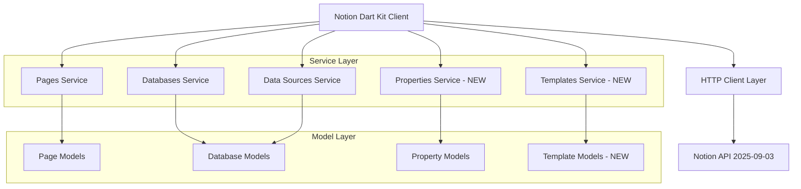
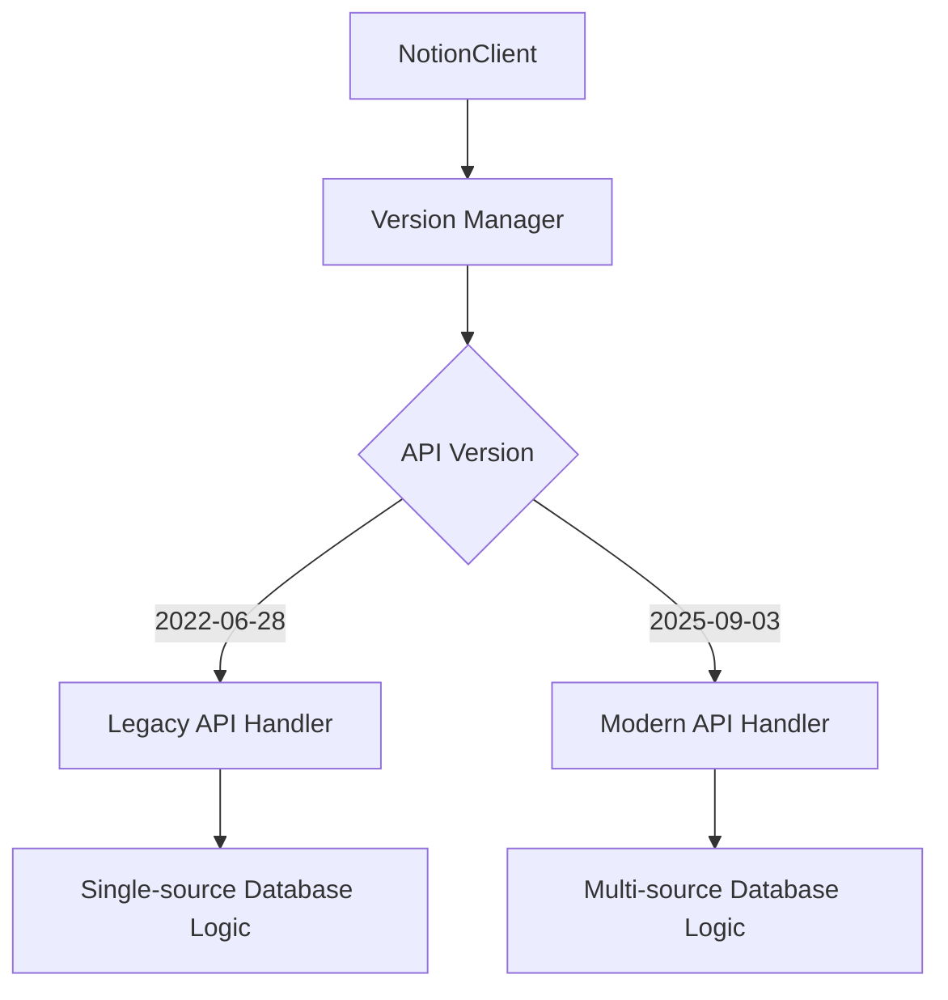
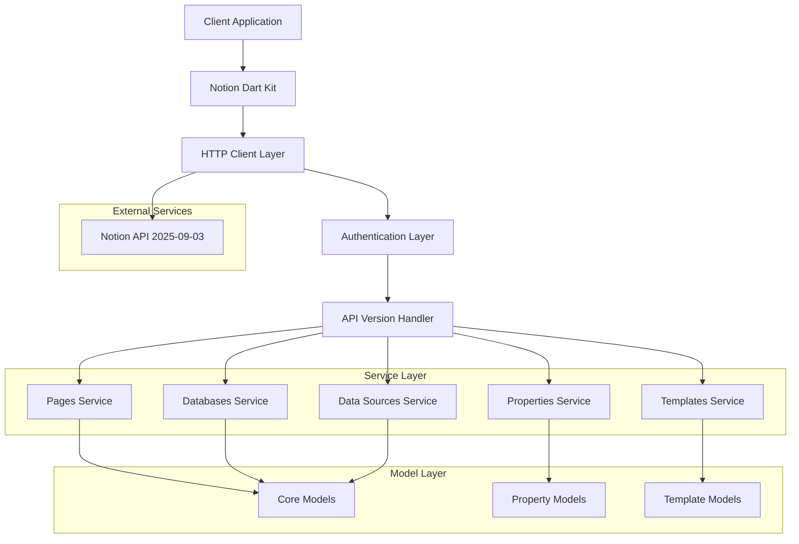

# Notion Dart Kit 実装技術仕様書

## 1. アーキテクチャ設計

### 1.1 全体アーキテクチャ



### 1.2 APIバージョン管理



## 2. 技術仕様

### 2.1 フロントエンド技術スタック
- **言語**: Dart 3.0+
- **HTTP Client**: dio package
- **JSON Serialization**: json_annotation + freezed
- **State Management**: 内部状態管理（サービスレイヤー）
- **Testing**: test package + mockito

### 2.2 バックエンド技術スタック
- **API**: Notion REST API 2025-09-03
- **認証**: Bearer Token (ntn_ / secret_ prefix対応)
- **データ形式**: JSON
- **エラーハンドリング**: カスタム例外クラス

## 3. ルート定義

### 3.1 新規エンドポイント

| エンドポイント | 目的 | 実装優先度 |
|---------------|------|-----------|
| GET /v1/pages/{page_id}/properties/{property_id} | ページプロパティ取得 | 高 |
| GET /v1/data_sources/{data_source_id}/templates | テンプレート一覧取得 | 中 |
| POST /v1/pages (with template) | テンプレート指定ページ作成 | 中 |

### 3.2 既存エンドポイントの拡張

| エンドポイント | 変更内容 | 実装優先度 |
|---------------|---------|-----------|
| POST /v1/pages | data_source_id parent対応 | 高 |
| GET /v1/databases/{database_id} | data_sources配列対応 | 高 |
| POST /v1/search | data_source filter対応 | 高 |

## 4. API定義

### 4.1 Page Property取得API

#### エンドポイント
```
GET /v1/pages/{page_id}/properties/{property_id}
```

#### リクエストパラメータ
| パラメータ名 | 型 | 必須 | 説明 |
|-------------|---|------|------|
| page_id | String | ✓ | ページID |
| property_id | String | ✓ | プロパティID |
| start_cursor | String | - | ページネーション開始位置 |
| page_size | int | - | 取得件数（最大100） |

#### レスポンス
```json
{
  "object": "property_item",
  "id": "property_id",
  "type": "relation",
  "relation": {
    "has_more": false,
    "next_cursor": null,
    "results": [
      {
        "id": "page_id"
      }
    ]
  }
}
```

#### Dart実装例
```dart
class PagesService {
  Future<PropertyValue> retrieveProperty(
    String pageId,
    String propertyId, {
    String? startCursor,
    int? pageSize,
  }) async {
    final response = await _httpClient.get(
      '/pages/$pageId/properties/$propertyId',
      queryParameters: {
        if (startCursor != null) 'start_cursor': startCursor,
        if (pageSize != null) 'page_size': pageSize.toString(),
      },
    );
    
    return PropertyValue.fromJson(response.data);
  }
}
```

### 4.2 Multi-source Database対応API

#### Database取得の拡張
```dart
class DatabasesService {
  Future<Database> retrieve(String databaseId) async {
    final response = await _httpClient.get('/databases/$databaseId');
    final database = Database.fromJson(response.data);
    
    // data_sources配列の処理
    if (database.dataSources.isNotEmpty) {
      // 複数データソース対応ロジック
    }
    
    return database;
  }
}
```

#### ページ作成の拡張
```dart
class PagesService {
  Future<Page> create({
    required Parent parent,
    Map<String, PropertyValue>? properties,
    List<Block>? children,
    String? templateId,
  }) async {
    final body = <String, dynamic>{
      'parent': parent.toJson(),
      if (properties != null) 'properties': properties.map((k, v) => MapEntry(k, v.toJson())),
      if (children != null) 'children': children.map((e) => e.toJson()).toList(),
      if (templateId != null) 'template': {'template_id': templateId},
    };
    
    final response = await _httpClient.post('/pages', data: body);
    return Page.fromJson(response.data);
  }
}
```

### 4.3 Template関連API

#### テンプレート一覧取得
```dart
class TemplatesService {
  Future<List<Template>> listTemplates(String dataSourceId) async {
    final response = await _httpClient.get('/data_sources/$dataSourceId/templates');
    
    final results = response.data['results'] as List;
    return results.map((json) => Template.fromJson(json)).toList();
  }
}
```

## 5. サーバーアーキテクチャ図



## 6. データモデル

### 6.1 新規データモデル

#### Template Model
```dart
@freezed
class Template with _$Template {
  const factory Template({
    required String id,
    required String name,
    String? description,
    required DateTime createdTime,
    required DateTime lastEditedTime,
  }) = _Template;
  
  factory Template.fromJson(Map<String, dynamic> json) => _$TemplateFromJson(json);
}
```

#### Property Item Model
```dart
@freezed
class PropertyItem with _$PropertyItem {
  const factory PropertyItem({
    required String object,
    required String id,
    required String type,
    required PropertyValue value,
    bool? hasMore,
    String? nextCursor,
  }) = _PropertyItem;
  
  factory PropertyItem.fromJson(Map<String, dynamic> json) => _$PropertyItemFromJson(json);
}
```

### 6.2 既存モデルの拡張

#### Database Model拡張
```dart
@freezed
class Database with _$Database {
  const factory Database({
    // 既存フィールド
    required String id,
    required List<RichText> title,
    // 新規フィールド
    required List<DataSource> dataSources,
    String? workspaceId,
  }) = _Database;
}
```

#### Parent Model拡張
```dart
@freezed
class Parent with _$Parent {
  const factory Parent.pageId({required String pageId}) = PageParent;
  const factory Parent.databaseId({required String databaseId}) = DatabaseParent;
  const factory Parent.dataSourceId({required String dataSourceId}) = DataSourceParent; // 新規
  const factory Parent.workspace() = WorkspaceParent;
}
```

## 7. データ定義言語（DDL）

### 7.1 設定データ構造

#### API Version Configuration
```dart
enum NotionApiVersion {
  v20220628('2022-06-28'),
  v20250903('2025-09-03');
  
  const NotionApiVersion(this.value);
  final String value;
}

class NotionClientConfig {
  final String token;
  final NotionApiVersion apiVersion;
  final Duration timeout;
  final bool enableRetry;
  
  const NotionClientConfig({
    required this.token,
    this.apiVersion = NotionApiVersion.v20250903,
    this.timeout = const Duration(seconds: 30),
    this.enableRetry = true,
  });
}
```

### 7.2 エラーハンドリング構造

```dart
@freezed
class NotionApiError with _$NotionApiError {
  const factory NotionApiError({
    required String object,
    required int status,
    required String code,
    required String message,
    Map<String, dynamic>? additionalData,
  }) = _NotionApiError;
  
  factory NotionApiError.fromJson(Map<String, dynamic> json) => _$NotionApiErrorFromJson(json);
}

class NotionException implements Exception {
  final NotionApiError error;
  final String? requestId;
  
  const NotionException(this.error, {this.requestId});
  
  @override
  String toString() => 'NotionException: ${error.message} (${error.code})';
}
```

### 7.3 認証トークン管理

```dart
class TokenValidator {
  static bool isValidToken(String token) {
    return token.startsWith('secret_') || token.startsWith('ntn_');
  }
  
  static TokenType getTokenType(String token) {
    if (token.startsWith('secret_')) return TokenType.legacy;
    if (token.startsWith('ntn_')) return TokenType.modern;
    throw ArgumentError('Invalid token format');
  }
}

enum TokenType {
  legacy,
  modern,
}
```

## 8. 実装フェーズ

### Phase 1: 基盤整備（1-2週間）
1. APIバージョン管理機能の実装
2. 新しいトークン形式対応
3. エラーハンドリングの拡張

### Phase 2: 重要機能実装（2-3週間）
1. Page Property取得エンドポイント
2. Multi-source Database基本対応
3. データモデルの拡張

### Phase 3: 追加機能実装（3-4週間）
1. Template関連機能
2. Workspace ID対応
3. 検索機能の拡張

### Phase 4: 最適化・テスト（1-2週間）
1. パフォーマンス最適化
2. 包括的テストの実装
3. ドキュメント更新

## 9. テスト戦略

### 9.1 ユニットテスト
- 各サービスクラスのメソッドテスト
- モデルクラスのシリアライゼーションテスト
- エラーハンドリングのテスト

### 9.2 統合テスト
- 実際のNotion APIとの通信テスト
- 新旧APIバージョンでの動作確認
- Multi-source databaseでの動作テスト

### 9.3 回帰テスト
- 既存機能の動作確認
- 後方互換性の検証
- パフォーマンス回帰の確認

## 10. デプロイメント戦略

### 10.1 段階的リリース
1. **Alpha版**: 新機能の基本実装
2. **Beta版**: 統合テスト完了版
3. **RC版**: 本番準備完了版
4. **Stable版**: 正式リリース

### 10.2 後方互換性
- 既存APIの継続サポート
- 段階的な移行パス提供
- 非推奨機能の明確な告知

### 10.3 ドキュメント更新
- API仕様書の更新
- 移行ガイドの作成
- サンプルコードの提供