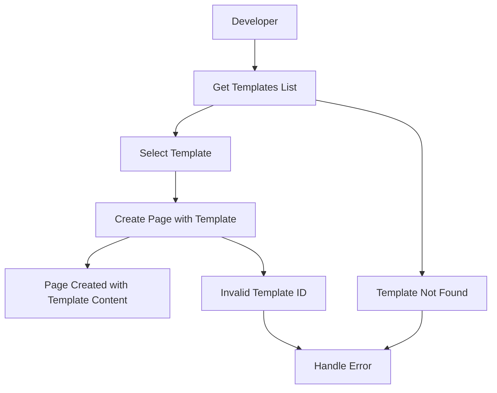

# Notion Dart Kit v0.2.1 - Template API 実装要件書

## 1. Product Overview

Notion Dart Kit v0.2.1では、最近Notion APIに追加されたTemplate API機能を包括的に実装します。この機能により、開発者はテンプレートの管理、テンプレート一覧の取得、テンプレートを使用したページ作成が可能になります。

- **目的**: 最新のNotion Template APIを完全サポートし、開発者がテンプレート機能を活用できるようにする
- **対象ユーザー**: Notion APIを使用するDart/Flutter開発者、特にテンプレート機能を必要とするアプリケーション開発者
- **市場価値**: Notion APIの最新機能をいち早く提供することで、開発者エクスペリエンスを向上させ、ライブラリの競争優位性を維持

## 2. Core Features

### 2.1 User Roles
テンプレートAPI機能は既存のユーザー権限体系に従います：

| Role | Core Permissions |
|------|------------------|
| Integration Token Owner | テンプレートの読み取り、テンプレートを使用したページ作成 |
| Workspace Member | 権限に応じたテンプレートアクセス |

### 2.2 Feature Module

Template API実装は以下の主要コンポーネントで構成されます：

1. **Templates Service**: テンプレート管理のためのサービスクラス
2. **Template Model**: テンプレートデータ構造の定義
3. **Page Creation Enhancement**: テンプレート指定でのページ作成機能
4. **Documentation & Examples**: 使用方法とサンプルコード

### 2.3 Page Details

| Component Name | Module Name | Feature description |
|----------------|-------------|---------------------|
| Templates Service | TemplatesService | テンプレート一覧取得、テンプレートメタデータ管理 |
| Template Model | Template | テンプレートデータ構造、JSON シリアライゼーション |
| Pages Service Enhancement | PagesService.create | テンプレート指定でのページ作成機能追加 |
| API Client Integration | NotionClient | テンプレートサービスの統合 |
| Test Suite | Template Tests | 包括的なテスト実装 |
| Documentation | API Documentation | 使用方法とサンプルコードの提供 |

## 3. Core Process

### 3.1 Template Management Flow

1. **テンプレート一覧取得**
   - データソースIDを指定してテンプレート一覧を取得
   - テンプレートメタデータの表示

2. **テンプレートを使用したページ作成**
   - テンプレートIDを指定してページを作成
   - テンプレートの内容が自動的に適用される

3. **エラーハンドリング**
   - 無効なテンプレートIDの処理
   - 権限不足エラーの適切な処理



## 4. User Interface Design

### 4.1 Design Style

Template APIは既存のNotion Dart Kitのデザイン原則に従います：

- **API Design**: RESTful、直感的なメソッド名
- **Type Safety**: 完全な型安全性とnull safety対応
- **Error Handling**: 包括的な例外処理
- **Documentation**: 豊富なコメントとサンプルコード
- **Consistency**: 既存のサービスクラスとの一貫性

### 4.2 API Design Overview

| Service Method | Parameters | Return Type | Description |
|----------------|------------|-------------|-------------|
| listTemplates | dataSourceId | Future<List<Template>> | データソースのテンプレート一覧を取得 |
| pages.create | parent, templateId, properties | Future<Page> | テンプレートを使用してページを作成 |

### 4.3 Code Examples

```dart
// テンプレート一覧の取得
final templates = await client.dataSources.listTemplates(dataSourceId);

// テンプレートを使用したページ作成
final page = await client.pages.create(
  parent: Parent.database(databaseId),
  templateId: templates.first.id,
  properties: {
    'Title': PropertyValue.title([RichText.text('新しいページ')])
  },
);
```