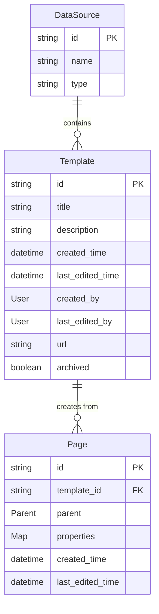

# Notion Dart Kit v0.2.1 - Template API 技術仕様書

## 1. Architecture design

```mermaid
graph TD
    A[Dart Application] --> B[NotionClient]
    B --> C[TemplatesService]
    B --> D[PagesService Enhanced]
    C --> E[Template Model]
    D --> F[Page Model Enhanced]
    
    C --> G[Notion API /v1/data_sources/{id}/templates]
    D --> H[Notion API /v1/pages with template]
    
    subgraph "Frontend Layer"
        A
    end
    
    subgraph "Service Layer"
        B
        C
        D
    end
    
    subgraph "Model Layer"
        E
        F
    end
    
    subgraph "External API"
        G
        H
    end
```

## 2. Technology Description

- **Frontend**: Dart SDK (既存のNotion Dart Kit基盤)
- **HTTP Client**: dio (既存の実装を継続使用)
- **Serialization**: json_annotation + json_serializable
- **Testing**: test package + mockito
- **Documentation**: dart doc comments

## 3. Route definitions

Template API機能は既存のNotionClientに統合されます：

| Service Method | Purpose |
|----------------|---------|
| client.dataSources.listTemplates() | データソースのテンプレート一覧取得 |
| client.pages.create(templateId: ...) | テンプレートを使用したページ作成 |

## 4. API definitions

### 4.1 Core API

#### Templates Service API

**テンプレート一覧取得**
```
GET /v1/data_sources/{data_source_id}/templates
```

Request Parameters:
| Param Name | Param Type | isRequired | Description |
|------------|------------|------------|-------------|
| data_source_id | String | true | データソースのID |
| start_cursor | String? | false | ページネーション用カーソル |
| page_size | int? | false | 取得件数（最大100） |

Response:
| Param Name | Param Type | Description |
|------------|------------|-------------|
| results | List<Template> | テンプレート一覧 |
| next_cursor | String? | 次のページのカーソル |
| has_more | bool | 次のページが存在するか |

**テンプレートを使用したページ作成**
```
POST /v1/pages
```

Request Parameters:
| Param Name | Param Type | isRequired | Description |
|------------|------------|------------|-------------|
| parent | Parent | true | 親ページまたはデータベース |
| template_id | String? | false | 使用するテンプレートのID |
| properties | Map<String, PropertyValue>? | false | ページプロパティ |

### 4.2 Type Definitions

```dart
// Template Model
@JsonSerializable()
class Template {
  final String id;
  final String title;
  final String? description;
  final DateTime createdTime;
  final DateTime lastEditedTime;
  final User createdBy;
  final User lastEditedBy;
  final String url;
  final bool archived;
  
  const Template({
    required this.id,
    required this.title,
    this.description,
    required this.createdTime,
    required this.lastEditedTime,
    required this.createdBy,
    required this.lastEditedBy,
    required this.url,
    required this.archived,
  });
  
  factory Template.fromJson(Map<String, dynamic> json) => 
      _$TemplateFromJson(json);
  Map<String, dynamic> toJson() => _$TemplateToJson(this);
}

// Templates Service
class TemplatesService {
  final NotionApiClient _client;
  
  const TemplatesService(this._client);
  
  Future<PaginatedList<Template>> listTemplates(
    String dataSourceId, {
    String? startCursor,
    int? pageSize,
  }) async {
    // Implementation
  }
}

// Enhanced Page Creation
class PagesService {
  Future<Page> create({
    required Parent parent,
    String? templateId,
    Map<String, PropertyValue>? properties,
    List<Block>? children,
  }) async {
    // Enhanced implementation with template support
  }
}
```

## 5. Server architecture diagram

Template API機能はクライアントサイドライブラリのため、サーバーアーキテクチャは適用されません。

## 6. Data model

### 6.1 Data model definition



### 6.2 Implementation Structure

```dart
// File Structure
lib/
├── src/
│   ├── models/
│   │   ├── template.dart          // Template model
│   │   └── template.g.dart        // Generated serialization
│   ├── services/
│   │   ├── templates_service.dart // Templates service
│   │   └── pages_service.dart     // Enhanced pages service
│   └── notion_client.dart         // Updated client
├── test/
│   ├── models/
│   │   └── template_test.dart
│   ├── services/
│   │   ├── templates_service_test.dart
│   │   └── pages_service_test.dart
│   └── integration/
│       └── template_integration_test.dart
└── example/
    └── template_example.dart

// Key Classes Implementation
class NotionClient {
  late final TemplatesService templates;
  late final PagesService pages; // Enhanced
  
  // Constructor updates to include templates service
}

// Error Handling
class TemplateNotFoundException extends NotionApiException {
  const TemplateNotFoundException(String message) : super(message);
}

class InvalidTemplateException extends NotionApiException {
  const InvalidTemplateException(String message) : super(message);
}
```

### 6.3 Migration Strategy

1. **Backward Compatibility**: 既存のPagesService.createメソッドは変更なし
2. **Optional Parameters**: templateIdは新しいオプションパラメータとして追加
3. **Gradual Adoption**: 開発者は段階的にテンプレート機能を採用可能
4. **Documentation**: 移行ガイドとサンプルコードを提供

### 6.4 Testing Strategy

```dart
// Unit Tests
- Template model serialization/deserialization
- TemplatesService methods
- Enhanced PagesService with template support
- Error handling scenarios

// Integration Tests  
- Real API calls with test templates
- End-to-end template workflow
- Performance benchmarks

// Mock Tests
- Network failure scenarios
- Invalid template ID handling
- Permission error handling
```

### 6.5 Performance Considerations

- **Caching**: テンプレート一覧のローカルキャッシュ機能
- **Pagination**: 大量のテンプレートに対する効率的なページネーション
- **Lazy Loading**: 必要に応じたテンプレート詳細の遅延読み込み
- **Error Recovery**: ネットワークエラー時の自動リトライ機能