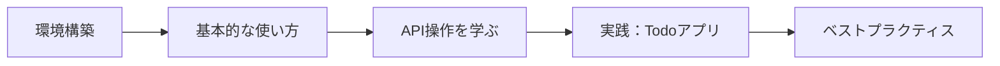

# 第1章: はじめに

> **この章の目標**: Notion Dart Kitとは何か、どんなことができるのかを理解する

---

## 📌 Notion Dart Kitとは？

**Notion Dart Kit**は、Notion APIをDart/Flutterアプリで簡単に使えるようにする、型安全で包括的なライブラリです。

### なぜこのライブラリを使うのか？

Notion APIを直接使うこともできますが、以下のような課題があります：

| 課題 | Notion Dart Kitの解決策 |
|:---|:---|
| 🔴 **型安全性の欠如** | ✅ Dartの型システムを活用した完全な型安全性 |
| 🔴 **複雑なJSONの扱い** | ✅ 自動的なJSON変換（シリアライゼーション） |
| 🔴 **レート制限の管理** | ✅ 組み込みのレート制限とリトライロジック |
| 🔴 **クエリの構築が面倒** | ✅ 直感的なクエリDSL（ドメイン固有言語） |
| 🔴 **エラーハンドリング** | ✅ 型安全な例外処理 |

---

## 🎯 できること

Notion Dart Kitを使うと、以下のことが簡単にできます：

### 1️⃣ ページの操作

```dart
// ページを取得
final page = await client.pages.retrieve(pageId);

// 新しいページを作成
final newPage = await client.pages.create(
  parent: Parent.database(databaseId: 'your-db-id').toJson(),
  properties: {
    'Title': PropertyValue.title([
      RichText.text(text: 'My New Page'),
    ]).toJson(),
  },
);
```

### 2️⃣ データベースのクエリ

```dart
// 型安全なフィルタでデータベースをクエリ
final filter = Filter.and([
  Filter.property('Status').select.equals('In Progress'),
  Filter.property('Priority').number.greaterThan(3),
]);

final results = await client.databases.query(
  databaseId,
  filter: filter.toJson(),
);
```

### 3️⃣ ブロックの操作

```dart
// ページにブロックを追加
await client.blocks.appendChildren(
  blockId: pageId,
  children: [
    Block.paragraph(
      paragraph: ParagraphBlock(
        richText: [RichText.text(text: 'Hello from Flutter!')],
      ),
    ).toJson(),
  ],
);
```

### 4️⃣ 検索

```dart
// ワークスペース全体を検索
final results = await client.search.search(
  query: 'meeting notes',
  filter: {'property': 'object', 'value': 'page'},
);
```

---

## ✨ 主な特徴

### 🔒 型安全性

```dart
// ❌ 間違った型を渡すとコンパイルエラー
PropertyValue.number('not a number');  // コンパイルエラー！

// ✅ 正しい型のみ受け付ける
PropertyValue.number(42);  // OK
```

### 🎨 直感的なAPI設計

```dart
// 読みやすく、書きやすいAPI
final filter = Filter.property('Status')
  .select
  .equals('Done');  // メソッドチェーンで直感的に構築
```

### 🔄 自動リトライ

```dart
// レート制限に達した場合、自動的にリトライ
// 開発者は何も気にする必要なし！
final page = await client.pages.retrieve(pageId);
```

### 📦 完全なモデル

21種類のプロパティタイプと31種類のブロックタイプを完全サポート：

| カテゴリ | サポート内容 |
|:---|:---|
| **プロパティ** | title, rich_text, number, select, multi_select, date, people, checkbox, url, email, phone, formula, relation, rollup, status など |
| **ブロック** | paragraph, heading, list, to_do, toggle, code, quote, callout, table, image, video, file, bookmark など |

---

## 🏗️ アーキテクチャ概要

Notion Dart Kitは、以下のレイヤーで構成されています：

```
┌─────────────────────────────────────┐
│     あなたのFlutterアプリ            │
├─────────────────────────────────────┤
│   NotionClient (Facade)             │
│   ├─ pages                          │
│   ├─ databases                      │
│   ├─ blocks                         │
│   ├─ search                         │
│   └─ users                          │
├─────────────────────────────────────┤
│   Services Layer                    │
│   (PagesService, DatabasesService等)│
├─────────────────────────────────────┤
│   Query DSL (Filter, Sort)          │
├─────────────────────────────────────┤
│   Models (Page, Database, Block等)  │
├─────────────────────────────────────┤
│   HTTP Client + Rate Limiter        │
├─────────────────────────────────────┤
│        Notion API                   │
└─────────────────────────────────────┘
```

**各レイヤーの役割**：

| レイヤー | 説明 |
|:---|:---|
| **NotionClient** | すべてのサービスへの統一されたアクセスポイント |
| **Services** | 各API領域（Pages, Databases等）の操作を提供 |
| **Query DSL** | 型安全なフィルタとソートの構築 |
| **Models** | Notion APIのデータ構造を表現 |
| **HTTP Client** | 低レベルのHTTP通信とレート制限を管理 |

---

## 📊 技術スタック

Notion Dart Kitは、以下のDartパッケージを使用しています：

| パッケージ | 用途 |
|:---|:---|
| **[freezed](https://pub.dev/packages/freezed)** | 不変データクラスとユニオン型 |
| **[json_serializable](https://pub.dev/packages/json_serializable)** | JSON自動変換 |
| **[dio](https://pub.dev/packages/dio)** | HTTP通信 |

---

## 🆚 他の選択肢との比較

### Notion APIを直接使う場合

```dart
// ❌ 直接API呼び出し（推奨されない）
final response = await http.post(
  Uri.parse('https://api.notion.com/v1/databases/$databaseId/query'),
  headers: {
    'Authorization': 'Bearer $token',
    'Notion-Version': '2022-06-28',
    'Content-Type': 'application/json',
  },
  body: jsonEncode({
    'filter': {
      'and': [
        {
          'property': 'Status',
          'select': {'equals': 'In Progress'}
        }
      ]
    }
  }),
);
final data = jsonDecode(response.body);
// 型安全性なし、エラーハンドリングも手動...
```

### Notion Dart Kitを使う場合

```dart
// ✅ Notion Dart Kit（推奨）
final filter = Filter.and([
  Filter.property('Status').select.equals('In Progress'),
]);

final results = await client.databases.query(
  databaseId,
  filter: filter.toJson(),
);
// 型安全、エラーハンドリング自動、読みやすい！
```

---

## 🎓 学習の進め方

このガイドは以下の順序で進めることをおすすめします：



1. **環境構築** - Notion統合の作成とライブラリのセットアップ
2. **基本的な使い方** - NotionClientの初期化と最初のAPI呼び出し
3. **API操作を学ぶ** - Pages、Databases、Blocksなどの操作方法
4. **実践** - 実際にTodoアプリを作ってみる
5. **ベストプラクティス** - プロダクションでの運用のコツ

---

## 🔍 こんな人におすすめ

### ✅ このライブラリが向いている人

- Flutterアプリで Notion と連携したい
- 型安全なコードを書きたい
- Notionをバックエンドとして使いたい
- 個人のメモアプリやTodoアプリを作りたい
- チームのNotionデータをモバイルアプリで扱いたい

### ⚠️ 注意が必要な場合

- **大規模なデータ処理**: Notion APIにはレート制限があります（3リクエスト/秒）
- **リアルタイム更新**: WebSocketはサポートされていません（ポーリングが必要）
- **複雑なクエリ**: SQLのような複雑なJOINやサブクエリはできません

---

## 📚 次のステップ

Notion Dart Kitの概要を理解できましたか？次の章では、実際に開発環境をセットアップしていきます。

**👉 [第2章: 環境構築](./02_setup.md)に進む**

---

**💡 ヒント**: 各章の最後には「次のステップ」があります。順番に進めることで、確実にスキルを身につけられます。

[📖 目次に戻る](./index.md)
