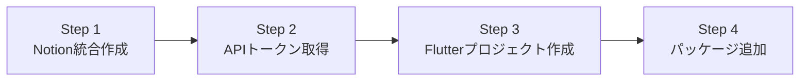

# 第2章: 環境構築

> **この章の目標**: Notion統合を作成し、FlutterプロジェクトでNotion Dart Kitを使えるようにする

前章では、Notion Dart Kitの概要を学びました。この章では、実際に開発を始めるための環境を構築していきます。

---

## 📋 環境構築の流れ

環境構築は以下の4つのステップで行います：



| ステップ | 作業内容 | 所要時間 |
|:---:|:---|:---:|
| **Step 1** | Notion統合（Integration）を作成する | 3分 |
| **Step 2** | APIトークンを取得してメモする | 2分 |
| **Step 3** | Flutterプロジェクトを作成する | 3分 |
| **Step 4** | notion-dart-kitパッケージを追加する | 7分 |

---

## 🔧 Step 1: Notion統合の作成

### 1.1 Notionの統合ページにアクセス

1. Notionにログインした状態で、以下のURLにアクセスします：

   **🔗 https://www.notion.so/my-integrations**

2. 「**+ 新しい統合**」または「**New integration**」ボタンをクリック

### 1.2 統合の基本情報を入力

以下の情報を入力します：

| 項目 | 入力内容 | 例 |
|:---|:---|:---|
| **名前** | 統合の名前（任意） | `My Flutter App` |
| **ワークスペース** | 使用するワークスペースを選択 | `個人用ワークスペース` |
| **タイプ** | 「内部統合」を選択 | Internal integration |

<details>
<summary>💡 内部統合 vs パブリック統合</summary>

- **内部統合**: 自分のワークスペース内でのみ使用（今回はこちら）
- **パブリック統合**: 他のユーザーも使えるアプリケーション（上級者向け）

初心者の方は「内部統合」を選んでください。
</details>

### 1.3 機能（Capabilities）の設定

統合に必要な権限を選択します。学習用には、すべてにチェックを入れることをおすすめします：

| 機能 | 説明 | 推奨 |
|:---|:---|:---:|
| **Read content** | コンテンツの読み取り | ✅ |
| **Update content** | コンテンツの更新 | ✅ |
| **Insert content** | コンテンツの挿入 | ✅ |
| **Read comments** | コメントの読み取り | ✅ |
| **Insert comments** | コメントの挿入 | ✅ |

### 1.4 統合を作成

「**Submit**」または「**送信**」ボタンをクリックして、統合を作成します。

---

## 🔑 Step 2: APIトークンの取得

統合が作成されると、**Internal Integration Token**が表示されます。

### 2.1 トークンをコピー

1. 「**Show**」ボタンをクリックしてトークンを表示
2. 「**Copy**」ボタンでトークンをコピー

トークンは以下のような形式です：

```
secret_xxxxxxxxxxxxxxxxxxxxxxxxxxxxxxxxxxxxxxxxxxxx
```

### 2.2 トークンを安全に保存

⚠️ **重要**: このトークンは再表示できません。安全な場所に保存してください。

| 保存方法 | 推奨度 | 備考 |
|:---|:---:|:---|
| パスワードマネージャー | ✅✅✅ | 1Password, Bitwarden等 |
| 環境変数ファイル（`.env`） | ✅✅ | Gitには含めない |
| テキストファイル | ✅ | 一時的なメモ用 |
| Gitリポジトリ | ❌ | **絶対にダメ！** |

---

## 📱 Step 3: Flutterプロジェクトの作成

### 3.1 新規プロジェクトを作成

ターミナル（コマンドプロンプト）で以下のコマンドを実行します：

```bash
flutter create notion_flutter_app
cd notion_flutter_app
```

**補足**:
- `notion_flutter_app`は任意のプロジェクト名です
- すでにプロジェクトがある場合は、このステップはスキップしてOK

### 3.2 Flutterのバージョン確認

Notion Dart Kitは、以下のバージョンをサポートしています：

```bash
flutter --version
```

**必要なバージョン**:

| 項目 | 最小バージョン |
|:---|:---|
| **Flutter** | 3.0.0 以上 |
| **Dart** | 3.0.0 以上 |

<details>
<summary>💡 バージョンが古い場合</summary>

以下のコマンドでFlutterをアップデートできます：

```bash
flutter upgrade
```
</details>

---

## 📦 Step 4: パッケージの追加

### 4.1 `pubspec.yaml`を編集

プロジェクトのルートにある`pubspec.yaml`ファイルを開き、`dependencies`セクションに以下を追加します：

```yaml
dependencies:
  flutter:
    sdk: flutter

  # Notion Dart Kit
  notion_dart_kit: ^0.1.2  # 最新バージョンを確認してください
```

**補足**:
- 最新バージョンは [pub.dev](https://pub.dev/packages/notion_dart_kit) で確認できます
- インデントに注意してください（2スペース）

### 4.2 パッケージをインストール

ターミナルで以下のコマンドを実行します：

```bash
flutter pub get
```

成功すると、以下のようなメッセージが表示されます：

```
Running "flutter pub get" in notion_flutter_app...
Resolving dependencies... (2.3s)
+ notion_dart_kit 0.1.2
+ dio 5.x.x
+ freezed_annotation 2.x.x
+ json_annotation 4.x.x
...
Changed X dependencies!
```

### 4.3 インストールの確認

以下のコマンドでインストールされたパッケージを確認できます：

```bash
flutter pub deps | grep notion
```

出力例：
```
└─ notion_dart_kit 0.1.2
```

---

## 🔌 Step 5: Notionページに統合を接続

APIトークンを取得しただけでは、まだNotionのページにアクセスできません。**統合をページに接続**する必要があります。

### 5.1 テスト用ページを作成

1. Notionで新しいページを作成（任意の名前、例: "Flutter Test Page"）
2. ページのURLをコピーしておきます

ページURLの例：
```
https://www.notion.so/Flutter-Test-Page-1234567890abcdef1234567890abcdef
```

### 5.2 統合をページに接続

1. ページ右上の「**...**」（3点リーダー）をクリック
2. 「**コネクト**」または「**Add connections**」を選択
3. 作成した統合（例: "My Flutter App"）を選択

✅ これで、この統合がこのページ（およびその子ページ）にアクセスできるようになりました。

<details>
<summary>💡 データベースに接続する場合</summary>

データベース全体に接続する場合も、同じ手順です：
1. データベースのページを開く
2. 右上の「**...**」→「**Add connections**」
3. 統合を選択

データベース内のすべてのページに統合がアクセスできるようになります。
</details>

---

## 🧪 Step 6: 動作確認

環境構築が完了したら、簡単な動作確認をしてみましょう。

### 6.1 テストコードを作成

`lib/main.dart`を以下のコードに置き換えます：

```dart
import 'package:flutter/material.dart';
import 'package:notion_dart_kit/notion_dart_kit.dart';

void main() {
  runApp(const MyApp());
}

class MyApp extends StatelessWidget {
  const MyApp({super.key});

  @override
  Widget build(BuildContext context) {
    return MaterialApp(
      title: 'Notion Test',
      home: Scaffold(
        appBar: AppBar(title: const Text('Notion API Test')),
        body: const NotionTestWidget(),
      ),
    );
  }
}

class NotionTestWidget extends StatefulWidget {
  const NotionTestWidget({super.key});

  @override
  State<NotionTestWidget> createState() => _NotionTestWidgetState();
}

class _NotionTestWidgetState extends State<NotionTestWidget> {
  String _status = 'Tap the button to test';
  bool _isLoading = false;

  // ⚠️ ここにあなたのAPIトークンを貼り付けてください
  final String _apiToken = 'secret_your_token_here';

  // ⚠️ ここにテストページのIDを貼り付けてください
  final String _pageId = 'your_page_id_here';

  Future<void> _testNotionApi() async {
    setState(() {
      _isLoading = true;
      _status = 'Testing...';
    });

    try {
      // NotionClientを初期化
      final client = NotionClient(token: _apiToken);

      // ページを取得
      final page = await client.pages.retrieve(_pageId);

      setState(() {
        _status = '✅ Success!\nPage title: ${page.id}';
        _isLoading = false;
      });

      // クライアントをクローズ
      client.close();
    } catch (e) {
      setState(() {
        _status = '❌ Error: $e';
        _isLoading = false;
      });
    }
  }

  @override
  Widget build(BuildContext context) {
    return Center(
      child: Padding(
        padding: const EdgeInsets.all(24.0),
        child: Column(
          mainAxisAlignment: MainAxisAlignment.center,
          children: [
            Text(
              _status,
              textAlign: TextAlign.center,
              style: const TextStyle(fontSize: 16),
            ),
            const SizedBox(height: 24),
            if (_isLoading)
              const CircularProgressIndicator()
            else
              ElevatedButton(
                onPressed: _testNotionApi,
                child: const Text('Test Notion API'),
              ),
          ],
        ),
      ),
    );
  }
}
```

### 6.2 APIトークンとページIDを設定

#### APIトークンの設定

Step 2で取得したトークンを、コード内の以下の部分に貼り付けます：

```dart
final String _apiToken = 'secret_your_token_here';  // ← ここ
```

#### ページIDの取得と設定

ページIDは、ページURLから取得できます。

**ページURL**:
```
https://www.notion.so/Flutter-Test-Page-1234567890abcdef1234567890abcdef
```

**ページID**（ハイフンなしの32文字）:
```
1234567890abcdef1234567890abcdef
```

コード内の以下の部分に貼り付けます：

```dart
final String _pageId = 'your_page_id_here';  // ← ここ
```

<details>
<summary>💡 ページIDの見つけ方</summary>

ページURLの最後の部分がページIDです：

| URL形式 | ページID |
|:---|:---|
| `https://notion.so/MyPage-abc123...` | `abc123...`（ハイフンを除く） |
| `https://notion.so/workspace/abc123?v=...` | `abc123`（ハイフンを除く） |

ハイフン（`-`）は除いてください。
</details>

### 6.3 アプリを実行

```bash
flutter run
```

画面に「Test Notion API」ボタンが表示されます。タップして、「✅ Success!」と表示されれば、セットアップ完了です！

---

## ⚠️ トラブルシューティング

### エラー: "Unauthorized" (401)

**原因**: APIトークンが間違っているか、統合がページに接続されていません。

**解決方法**:
1. APIトークンが正しくコピーされているか確認
2. Notionページに統合が接続されているか確認（Step 5.2）

### エラー: "Not Found" (404)

**原因**: ページIDが間違っているか、ページが存在しません。

**解決方法**:
1. ページIDが正しいか確認（ハイフンを除く32文字）
2. ページが削除されていないか確認

### エラー: "Rate Limited" (429)

**原因**: リクエストが多すぎます。

**解決方法**:
- 少し待ってから再試行してください
- Notion Dart Kitは自動的にリトライしますが、短時間に何度もボタンを押すとこのエラーが出ます

---

## 🔒 セキュリティのベストプラクティス

### APIトークンの管理

ソースコードに直接APIトークンを書くのは、学習用途のみにしてください。実際のアプリでは、以下の方法を使用します：

#### 方法1: 環境変数を使う（推奨）

1. プロジェクトルートに`.env`ファイルを作成：

```env
NOTION_API_TOKEN=secret_your_token_here
```

2. `.gitignore`に`.env`を追加：

```gitignore
# .gitignore
.env
```

3. `flutter_dotenv`パッケージを使って読み込む：

```yaml
# pubspec.yaml
dependencies:
  flutter_dotenv: ^5.1.0
```

```dart
import 'package:flutter_dotenv/flutter_dotenv.dart';

Future<void> main() async {
  await dotenv.load();
  runApp(const MyApp());
}

// トークンを取得
final token = dotenv.env['NOTION_API_TOKEN']!;
```

#### 方法2: セキュアストレージを使う

`flutter_secure_storage`パッケージを使って、デバイスに安全に保存します：

```yaml
# pubspec.yaml
dependencies:
  flutter_secure_storage: ^9.0.0
```

```dart
import 'package:flutter_secure_storage/flutter_secure_storage.dart';

final storage = FlutterSecureStorage();

// 保存
await storage.write(key: 'notion_token', value: 'secret_...');

// 読み込み
final token = await storage.read(key: 'notion_token');
```

---

## ✅ チェックリスト

環境構築が完了したか、以下のチェックリストで確認しましょう：

- [ ] Notion統合を作成した
- [ ] APIトークンを取得して安全に保存した
- [ ] Flutterプロジェクトを作成した
- [ ] `notion_dart_kit`パッケージをインストールした
- [ ] テスト用ページを作成し、統合を接続した
- [ ] 動作確認用のコードが正常に動作した

すべてにチェックが入れば、準備完了です！

---

## 📚 次のステップ

環境構築お疲れさまでした！次の章では、Notion Dart Kitの基本的な使い方を学んでいきます。

**👉 [第3章: 基本的な使い方](./03_basic_usage.md)に進む**

---

**💡 ヒント**: この章で設定したAPIトークンとページIDは、今後の章でも使用します。メモしておくと便利です。

[📖 目次に戻る](./index.md) | [⬅️ 前の章](./01_introduction.md) | [➡️ 次の章](./03_basic_usage.md)
